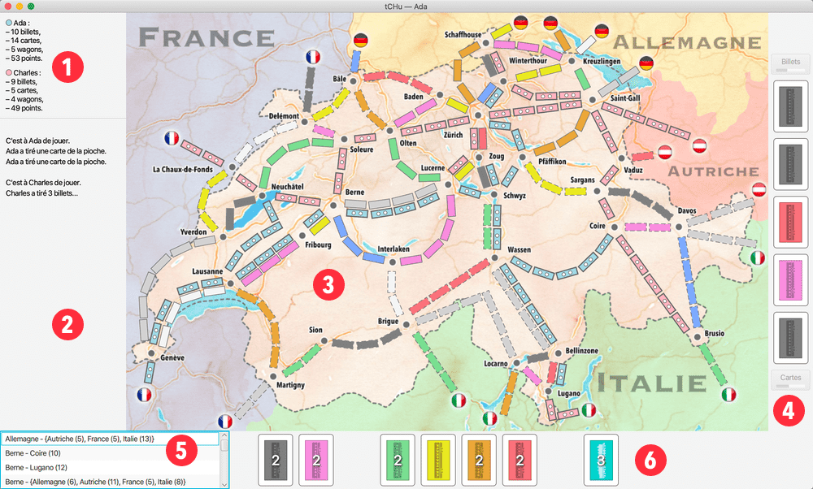

# tCHu: A Swiss Railway Adventure

## Overview

tCHu is a two-player adaptation of the Swiss version of the renowned board game **Ticket to Ride**. Developed in Java as part of CS-108 at EPFL, tCHu offers an interactive experience where players compete to connect various cities across Switzerland and neighboring countries by claiming railway routes.

## Features

- **Network Play**: Supports remote play over a client-server architecture.
- **Reactive User Interface**: A JavaFX-based GUI dynamically updates with game state changes.
- **Serialization**: Efficient communication between client and server through custom serialization mechanisms.
- **Game Rules Implementation**: Enforces Ticket to Ride rules, including route claiming, card drawing, and scoring.
- **Observable Design Pattern**: Ensures synchronization between the game state and the GUI.

## Implementation Details

- **User Interface**: Developed using JavaFX for graphical components and event handling.
- **Game Logic**: Encapsulates rules and mechanics within dedicated classes to ensure modularity and maintainability.

### Remote Play

tCHu employs a **client-server model** for remote play.

- **Server**:
  - Manages the overall game state and interfaces with the first player.
  - Acts as a central hub, receiving actions from the client and broadcasting state updates to both players.
- **Client**:
  - Manages the second player's interface.
  - Relays player actions to the server and receives updates to maintain synchronization.

Communication between the client and server is facilitated through serialized messages exchanged over a TCP connection.

### Observable Game State

To decouple the game logic from the user interface, tCHu implements the **Observable Design Pattern**:

- **Observable Objects**:
  - Classes like `ObservableGameState` track public and private game states.
  - Changes to the state (e.g., a player claims a route) trigger notifications to observers.
- **Observers**:
  - GUI components (e.g., the map view, hand view, and info view) observe the game state and update dynamically when notified.

This reactive design ensures that the user interface is always synchronized with the underlying game logic.

### Graphical User Interface

The graphical interface of tCHu is divided into four main components:

1. **Map View**: Displays the game board with routes and stations.
2. **Decks View**: Shows the draw piles and face-up cards available for selection.
3. **Hand View**: Represents the player's hand, including tickets and cards.
4. **Info View**: Provides game statistics and recent action logs.

Interaction mechanisms include:

- **Initial Ticket Selection**: Modal dialogs for choosing initial destination tickets.
- **Card Drawing**: Clickable areas for drawing cards from the deck or selecting face-up cards.
- **Route Claiming**: Interactive route selection with visual cues indicating claimable routes.

### Main Programs

The project is structured around two main entry points:

1. **Server Program**:
   - Initializes the game state and waits for a client connection.
   - Starts the game once both players are connected.
2. **Client Program**:
   - Connects to the server using a specified host and port.
   - Provides the interface for the second player.